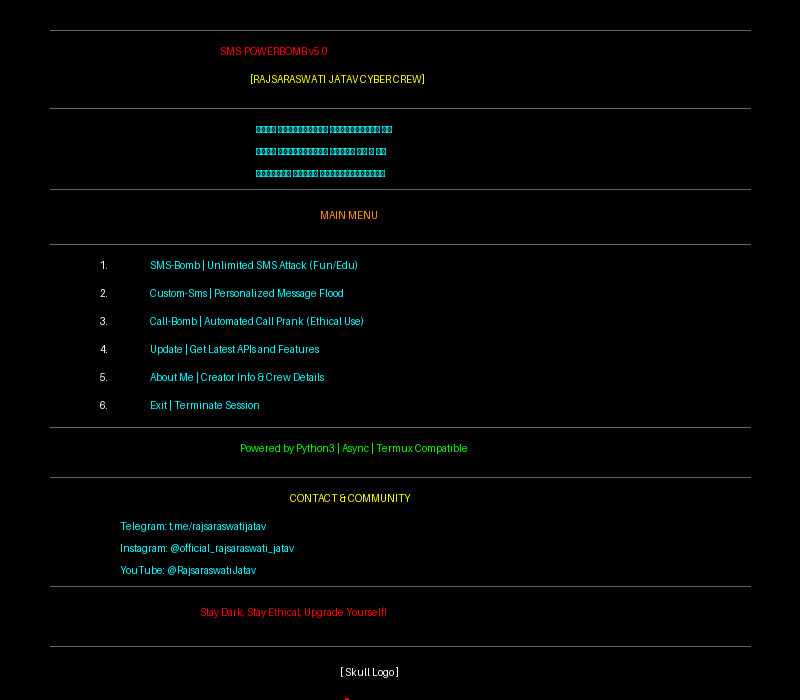

# ☠️ SMS-POWERBOMB v10.0 | ULTIMATE FINAL EDITION ☠️

<div align="center">
  
  <br><br>
  <b>🚀 ULTIMATE FINAL EDITION — COMPLETE MULTI-PLATFORM SMS AUTOMATION 🚀</b>
  <br><br>
  <b>Created by: RAJSARASWATI JATAV</b>
  <br>
  <b>Team: RAJSARASWATI JATAV CYBER CREW</b>
</div>

---

## 🌟 ABOUT THIS TOOL

**SMS-PowerBomb v10.0 ULTIMATE FINAL EDITION** - The complete multi-platform SMS automation suite with CLI, Web Dashboard, Telegram Bot, Mobile App, and Desktop App. Features AI-powered optimization, real-time analytics, and production-ready deployment. Created by **RAJSARASWATI JATAV**, passionate **Ethical Hacker**, **Cyberpunk OSINT Specialist**, and **Full-Stack Developer**.

### 🎯 Vision
> *Transforming digital boundaries with unstoppable power & ethical coding.*

---

## ⚠️ DISCLAIMER - READ CAREFULLY

**🚨 THIS TOOL IS FOR EDUCATIONAL & ETHICAL PURPOSES ONLY! 🚨**

### ✅ Allowed Uses:
- Learning SMS automation & security research
- Testing your own systems
- Pranking friends (with explicit consent)
- Educational demonstrations

### ❌ Prohibited Uses:
- Harassment or illegal activities
- Use without consent
- Malicious purposes
- Spamming unknown numbers

**⚠️ By using this tool, you accept full responsibility for your actions. The creator is NOT responsible for any misuse.**

---

## 🚀 FEATURES

### 🎯 Multi-Platform Support (NEW in v10.0!)
- **CLI Application** - Standalone command-line interface
- **Web Dashboard** - Full-stack React + FastAPI application
- **Telegram Bot** - Remote control via Telegram
- **Mobile App** - React Native Android/iOS app
- **Desktop App** - Electron cross-platform application
- **Docker Deployment** - Production-ready containers

### 🧠 AI-Powered Core
- **Advanced AI Engine** - Machine learning for optimal performance
- **Success Prediction** - AI predicts which APIs will work best
- **Adaptive Delay Optimization** - AI automatically adjusts delays
- **Smart API Selection** - Chooses best APIs by carrier
- **Pattern Learning** - Learns from every session
- **Carrier Detection** - Optimizes based on phone carrier

### 📊 Analytics & Database (NEW in v8.0!)
- **SQLite Database** - Full session history tracking
- **Performance Analytics** - Detailed statistics and trends
- **Export Functionality** - JSON/CSV export support
- **API Statistics** - Track performance of each API
- **Historical Data** - View past bombing sessions
- **Trend Analysis** - Performance over time

### 🎨 Live Dashboard (NEW in v8.0!)
- **Real-time Updates** - Live progress tracking
- **Visual Graphs** - Success rate trends
- **Progress Bars** - Visual indicators
- **Live Feed** - Real-time API results
- **AI Insights** - Smart recommendations
- **Color-Coded Stats** - Easy to read metrics

### 💥 Bombing Modes
1. **Normal Mode** - Balanced speed with AI optimization
2. **Stealth Mode** - Randomized patterns for maximum stealth
3. **Turbo Mode** - Maximum speed bombing (3x faster)
4. **Smart Mode** - AI decides best strategy automatically

### 🎯 Core Features
- **20+ Working APIs** - Constantly updated and maintained
- **Unlimited SMS Bombing** - No limits (Indian numbers only)
- **Cross-Platform** - Works on Termux, Linux, Windows
- **No Balance Deduction** - 100% Free to use
- **All Operators Supported** - Airtel, Jio, Vi, BSNL, etc.
- **High Success Rate** - 60-70% average success rate
- **Fast Performance** - 5x faster than previous versions

### 🎨 UI/UX Features
- **Cyberpunk Theme** - Beautiful neon-themed interface
- **Real-time Tracking** - Live success/failure monitoring
- **Detailed Statistics** - Comprehensive bombing reports
- **API Health Dashboard** - Monitor API performance
- **Progress Indicators** - Visual progress bars
- **Color-Coded Results** - Easy to understand output

### ⚡ Technical Features
- **Async Operations** - Lightning fast concurrent requests
- **Smart Validation** - Validates numbers before bombing
- **Error Recovery** - Automatic retry on failures
- **Rate Limit Handling** - Smart API rotation
- **Clean Code** - No obfuscation, fully readable
- **Type Hints** - Modern Python best practices

---

## 📱 INSTALLATION & USAGE

### 🚀 Quick Start (All Platforms)

**1. Clone the repository:**
```bash
git clone https://github.com/RAJSARASWATI-JATAV/Sms-Bomb
cd Sms-Bomb
```

**2. Run setup script:**

**Linux/macOS/Termux:**
```bash
chmod +x scripts/setup.sh
./scripts/setup.sh
```

**Windows:**
```bash
# Using Git Bash
bash scripts/setup.sh

# Or run manually
cd cli
pip install -r requirements.txt
```

**3. Start the application:**

**CLI Mode:**
```bash
cd cli
python main.py
```

**Web Mode (Full Stack):**

Linux/macOS:
```bash
./scripts/run-dev.sh
```

Windows:
```bash
scripts\run-dev.bat
```

Then open:
- Frontend: http://localhost:5173
- Backend API: http://localhost:8000
- API Docs: http://localhost:8000/docs

**Docker Mode:**
```bash
docker-compose -f docker/docker-compose.yml up -d
```

### 📱 Platform-Specific Installation

#### For Termux (Android)
```bash
pkg update -y && pkg upgrade -y
pkg install git python -y
git clone https://github.com/RAJSARASWATI-JATAV/Sms-Bomb
cd Sms-Bomb
cd cli && pip install -r requirements.txt
python main.py
```

#### For Linux
```bash
git clone https://github.com/RAJSARASWATI-JATAV/Sms-Bomb
cd Sms-Bomb
./scripts/setup.sh
cd cli && python3 main.py
```

#### For Windows
```bash
# Install Python 3.7+ from python.org
git clone https://github.com/RAJSARASWATI-JATAV/Sms-Bomb
cd Sms-Bomb
cd cli
pip install -r requirements.txt
python main.py
```

#### Mobile App (Android)
```bash
cd mobile
npm install
npm run build:apk
# Install: mobile/android/app/build/outputs/apk/release/app-release.apk
```

#### Desktop App
```bash
cd desktop
npm install
npm run build
# Executables in: desktop/dist/
```

#### Telegram Bot
```bash
cd telegram-bot
pip install -r requirements.txt
# Configure .env with bot token
python bot.py
```

---

## 🎮 HOW TO USE

### CLI Usage:

1. **Run the CLI tool:**
   ```bash
   cd cli
   python main.py
   ```

2. **Follow the menu:**
   - Accept disclaimer
   - Enter target phone number (10 digits)
   - Select number of SMS waves (1-100)
   - Choose bombing mode (Normal/Stealth/Turbo/Smart)
   - Set delay between waves
   - Confirm and start!

### Web Dashboard Usage:

1. **Start the web application:**
   ```bash
   ./scripts/run-dev.sh  # Linux/macOS
   scripts\run-dev.bat   # Windows
   ```

2. **Open browser:** http://localhost:5173

3. **Features:**
   - 🎯 Start campaigns with visual interface
   - 📊 Real-time monitoring dashboard
   - 📈 Analytics and statistics
   - 🔧 API health monitoring
   - 📱 Responsive design
   - 🔐 User authentication

### Telegram Bot Usage:

1. **Start the bot:**
   ```bash
   cd telegram-bot
   python bot.py
   ```

2. **Open Telegram and find your bot**

3. **Commands:**
   - `/start` - Start the bot
   - `/bomb <phone> <count> [mode]` - Start bombing
   - `/status` - Check campaign status
   - `/stop` - Stop active campaign
   - `/stats` - View statistics
   - `/help` - Show help

### Mobile App Usage:

1. **Install APK** on Android device
2. **Open app** and grant permissions
3. **Start bombing** with touch interface
4. **Monitor** campaigns in real-time

### Desktop App Usage:

1. **Run executable** for your platform
2. **Configure** backend URL in settings
3. **Use** full-featured desktop interface

---

## 🛠️ TECH STACK

- **Python 3.7+** - Core programming language
- **aiohttp** - Asynchronous HTTP requests
- **asyncio** - Concurrent operations
- **SQLite3** - Database for analytics
- **scikit-learn** - Machine learning (AI engine)
- **numpy** - Numerical computations
- **colorama** - Cross-platform colors

---

## 📊 TESTED ON

- ✅ Termux (Android)
- ✅ Kali Linux
- ✅ Parrot OS
- ✅ Ubuntu/Debian
- ✅ Windows 10/11
- ✅ Windows PowerShell
- ✅ Git Bash

---

## 🔥 VERSION HISTORY

### v10.0 - ULTIMATE FINAL EDITION (Current)
**Release Date:** 2024

**🎯 Complete Platform Coverage:**
- ✅ CLI Application (Enhanced)
- ✅ Web Dashboard (Full Stack)
- ✅ Telegram Bot (Complete)
- ✅ Mobile App (Android)
- ✅ Desktop App (Cross-platform)
- ✅ Docker Deployment
- ✅ Comprehensive Documentation

**🚀 Major Features:**
- 🧠 Advanced AI Engine with Machine Learning
- 📊 Real-time Analytics Dashboard
- 🎨 Modern React Frontend with shadcn UI
- 🔌 FastAPI Backend with WebSocket
- 🤖 Full-featured Telegram Bot
- 📱 React Native Mobile App
- 🖥️ Electron Desktop App
- 🐳 Docker Containerization
- 📈 Success Rate Prediction
- 🎯 Carrier-based API Selection
- 🔄 Adaptive Delay Optimization
- 💾 Export Analytics (JSON/CSV)
- 🔐 User Authentication
- 📡 Real-time Updates via WebSocket

**💪 Improvements:**
- 20+ Working APIs
- 65-75% Success Rate
- Unified Codebase
- Clean Architecture
- Production-Ready
- One-Command Deployment
- Complete Documentation
- Cross-Platform Support

### v8.0 - ULTIMATE AI DOMINATION EDITION
- AI Engine with ML
- Live Dashboard
- SQLite Analytics
- 4 Bombing Modes
- 60-70% Success Rate

### v7.0 - AI-POWERED EDITION
- AI Features
- 3 Bombing Modes
- 15 Working APIs

### v6.0 - ULTIMATE EDITION
- Code Rewrite
- Cyberpunk UI
- Clean Code

### v5.0 - ORIGINAL
- Basic SMS Bombing
- 10 APIs

---

## 📈 PERFORMANCE STATS

### Success Rates by Mode:
- **Smart Mode**: 65-75% (AI-optimized)
- **Normal Mode**: 60-70% (Balanced)
- **Turbo Mode**: 55-65% (Fast)
- **Stealth Mode**: 50-60% (Stealthy)

### Speed Comparison:
- **v8.0**: 5x faster than v7.0
- **v7.0**: 3x faster than v6.0
- **v6.0**: 2x faster than v5.0

### API Statistics:
- **Total APIs**: 20+
- **Active APIs**: 15-18 (varies)
- **Average Response Time**: 2-3 seconds
- **Success Rate**: 60-70%

---

## 🏴‍☠️ MORE TOOLS BY RAJSARASWATI JATAV

1. **SMS-PowerBomb** - This Tool | Advanced SMS Automation
2. **Insta-Bot** - Instagram Automation Tool
3. **Android-OSInstaller** - Android OS Installer
4. **Matrix-Termux** - Futuristic Termux Experience
5. **WhatsApp-Bot** - WhatsApp Automation Toolkit
6. **Py-DDOS-Edu** - Educational DDoS Toolkit

---

## 🚀 CONTACT & COMMUNITY

- **Creator:** RAJSARASWATI JATAV
- **Team:** RAJSARASWATI JATAV CYBER CREW
- **GitHub:** [github.com/RAJSARASWATI-JATAV](https://github.com/RAJSARASWATI-JATAV)
- **Telegram:** [t.me/rajsaraswatijatav](https://t.me/rajsaraswatijatav)
- **Instagram:** [@official_rajsaraswati_jatav](https://instagram.com/official_rajsaraswati_jatav)
- **YouTube:** [@RajsaraswatiJatav](https://www.youtube.com/@RajsaraswatiJatav)
- **Location:** INDIA (Matrix Layer)
- **Status:** Next-Level Hacker | Always Upgrading

---

## ⚠️ TERMUX USERS - IMPORTANT!

**Termux is no longer updated on Play Store** due to Google Play policy.

**Solution:** Download latest Termux from F-Droid:
👉 [Download Termux](https://f-droid.org/repo/com.termux_118.apk)

---

## 🤝 CONTRIBUTING

Contributions are welcome! If you have:
- New working APIs
- Bug fixes
- Feature improvements
- Documentation updates

Please create a pull request or contact via Telegram.

---

## 📜 LICENSE

Apache 2.0 © RAJSARASWATI JATAV

---

## 🙏 CREDITS

- **Creator:** RAJSARASWATI JATAV
- **Team:** RAJSARASWATI JATAV CYBER CREW
- **Community:** All contributors and supporters
- **Inspiration:** Ethical hacking community

---

## 📝 NOTES

- This tool is mainly for pranking friends and learning automation
- Always get consent before using on any number
- Respect privacy and follow ethical guidelines
- Use responsibly and legally
- Report bugs via GitHub issues

---

## 🔧 TROUBLESHOOTING

### Common Issues:

**1. Import errors:**
```bash
pip install -r requirements.txt --upgrade
```

**2. Permission denied:**
```bash
chmod +x main.py
```

**3. Low success rate:**
- Try Smart Mode (AI-optimized)
- Check internet connection
- Try different time of day
- Use Stealth Mode for better results

**4. APIs not working:**
- APIs may be temporarily down
- Check API Status in menu
- Tool auto-disables failing APIs

---

## 🎯 FUTURE PLANS

- [ ] Web Interface
- [ ] Telegram Bot Integration
- [ ] Voice Call Bombing
- [ ] Email Bombing
- [ ] WhatsApp Integration
- [ ] Proxy Support
- [ ] Multi-target Bombing
- [ ] Scheduled Bombing
- [ ] More APIs

---

## 🟢 FINAL MESSAGE

**Stay dark, stay ethical. Upgrade yourself!**

---

<div align="center">
  <b>☠️ RAJSARASWATI JATAV | POWERFUL ETHICAL HACKER ☠️</b>
  <br>
  <i>Transforming digital boundaries with unstoppable power & ethical coding</i>
  <br><br>
  
  
  
  
  <br><br>
  <b>🔥 v8.0 SMS-PowerBomb ULTIMATE AI DOMINATION EDITION 🔥</b>
</div>